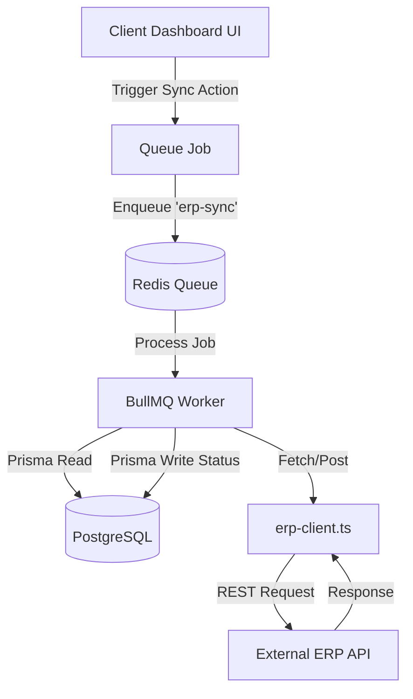

# Studio Masons ERP — Project Architecture & Developer Guide

Welcome to the **Studio Masons ERP** codebase documentation. Studio Masons is a design-and-build (interior fit-out / construction) firm, and this application is the operational backbone that follows a project from its first site survey all the way through design approvals, procurement, on-site quality control, snag resolution, audit, handover, and post-handover defect liability.

This document is an exhaustive, point-to-point walkthrough of the project. It explains the directory structure, the purpose of every file and the key functions inside it, and the four cross-cutting architectures that hold the app together:

1. **Routing & the layout shell** — how Next.js App Router, route groups, and nested layouts assemble each screen.
2. **Authentication & authorization** — how Supabase proves identity, how middleware guards every route, and how role checks live in the app's own database.
3. **State & data flow** — how React Contexts hold client state, how Server Actions read/write PostgreSQL through Prisma, and how the `localStorage` cache fits in.
4. **External integration & background work** — how the ERP-sync queue (BullMQ + Redis) keeps slow third-party calls off the request path.

> **A note on the data model.** Early in the project the UI was driven by hardcoded demo data. It has since been migrated so that **the PostgreSQL database is the single source of truth** for every page — nothing in the UI is hardcoded. Reads go through batched Server Actions on mount; writes are persisted optimistically (the UI updates immediately, the database catches up in the background). `localStorage` is used only for a few small, device-local preferences (which project is selected, which notifications have been read, and appearance settings).

---

## 1. Technology Stack

| Layer | Technology | Notes |
| :--- | :--- | :--- |
| Framework | **Next.js 15** (App Router) | React Server Components + Server Actions; deployed on Vercel. |
| Language | **TypeScript 5** | Strict typing across client, server actions, and Prisma. |
| UI runtime | **React 19** | Client components for the interactive dashboard shell. |
| Styling | **Tailwind CSS v4** + **shadcn/ui** (Radix primitives) | Utility-first CSS; `cn()` helper merges classes. Brand accent is `#e30613` (Studio Masons red). |
| Database | **PostgreSQL** | Hosted (Supabase / serverless Postgres). |
| ORM | **Prisma 5** | Client generated to a custom path, `app/generated/prisma`. |
| Auth | **Supabase Auth** (`@supabase/ssr`) | Cookie-based sessions; identity only — authorization lives in the app DB. |
| Background jobs | **BullMQ 5** + **Redis** | Async ERP synchronization worker. |
| PDF generation | **jsPDF**, **jspdf-autotable**, **pdf-lib** | Client-side purchase-order document builder. |
| Spreadsheet parsing | **xlsx (SheetJS)** | Imports BOQ workbooks into priced PO lines. |
| Analytics | **@vercel/analytics** | Page-view analytics. |

Key `package.json` scripts:

* `dev` — `next dev` (local development server).
* `build` — `prisma generate && next build` (Prisma client is regenerated before every build so the custom-path client is always fresh).
* `postinstall` — `prisma generate` (ensures the client exists right after `npm install`, including on CI).
* `start` — `next start` (production server).
* `lint` — `eslint`.

---

## 2. Project Directory Structure

```text
studio-masons-erp/
├── package.json               # Manifest, dependencies, scripts
├── tsconfig.json              # TypeScript compiler config (path alias "@/*" → project root)
├── tailwind.config.ts         # Tailwind theme & content globs
├── postcss.config.mjs         # PostCSS pipeline (Tailwind v4)
├── next.config.ts             # Next config — forces Prisma engine into serverless bundles
├── vercel.json                # Vercel project config (currently empty / defaults)
├── eslint.config.mjs          # Flat ESLint config (eslint-config-next)
├── components.json            # shadcn/ui generator config
├── .env / .env.example        # Environment variables (DB, Supabase, ERP, Redis)
├── README.md                  # Stock create-next-app readme
├── AGENTS.md / CLAUDE.md      # Guidelines for AI coding agents
├── middleware.ts              # Edge middleware → Supabase session refresh + auth gate
│
├── erp-client.ts              # REST client for the external ERP API
├── erp-sync.worker.ts         # Standalone BullMQ worker process (ERP sync jobs)
│
├── prisma/
│   └── schema.prisma          # All database models, enums, and relations (PostgreSQL)
│
├── lib/
│   ├── prisma.ts              # Singleton PrismaClient (hot-reload-safe)
│   ├── auth.ts                # getCurrentUser() + requireRole() — server-side authz
│   ├── utils.ts               # cn() Tailwind class-merge helper
│   ├── toast.tsx              # App-wide toast notification context
│   └── supabase/
│       ├── server.ts          # Supabase client for Server Components / Actions / Routes
│       ├── client.ts          # Supabase client for the browser
│       ├── admin.ts           # Service-role (privileged) Supabase client — SERVER ONLY
│       └── middleware.ts      # updateSession() — session refresh + redirect rules
│
├── contexts/
│   ├── ProjectContext.tsx     # Global store: projects, vendors/POs, invoices, payments, activity
│   ├── NavigationContext.tsx  # Transition-wrapped router navigation (drives loading overlay)
│   └── AppearanceContext.tsx  # Theme color, sidebar width, date format (localStorage)
│
├── components/
│   ├── layout/
│   │   ├── Sidebar.tsx        # Fixed left navigation rail
│   │   ├── Topbar.tsx         # Search, project selector, notifications, account menu
│   │   └── NavLoadingOverlay.tsx  # Spinner shown over content during navigation
│   └── ui/                    # shadcn/ui primitives (button, badge, card, tabs, table, dialog, sheet)
│
└── app/                       # Next.js App Router root
    ├── layout.tsx             # Root <html> document — fonts, metadata, globals.css
    ├── page.tsx               # "/" → redirects to /dashboard
    ├── globals.css            # Base styles, CSS variables, scrollbars, accent remapping
    ├── not-found.tsx          # 404 page
    ├── global-error.tsx       # Root error boundary
    │
    ├── login/page.tsx         # Email/password sign-in (public)
    ├── set-password/page.tsx  # Post-invite / reset password screen (public)
    ├── auth/
    │   ├── callback/route.ts  # PKCE code → session exchange
    │   └── confirm/route.ts   # token_hash OTP verification (invite/recovery links)
    │
    ├── generated/prisma/      # Generated Prisma Client (types + query engine) — do not edit
    │
    └── (erp)/                 # Route Group: the authenticated dashboard shell
        ├── layout.tsx         # Mounts providers + Sidebar/Topbar/main shell
        ├── loading.tsx        # Suspense fallback during route transitions
        ├── error.tsx          # Error boundary for ERP routes
        │
        ├── bootstrap.ts       # Single batched loader for all global stores (Server Action)
        ├── data.ts            # Loaders/savers for most pages (Server Actions)
        │
        ├── dashboard/page.tsx        # KPIs, projects grid, recent activity feed
        ├── site-survey/page.tsx      # Site surveys (dimensions, notes, photos, checklist)
        ├── design/page.tsx           # Drawing approvals, versions, client check-offs
        ├── purchase-orders/          # PO generation subsystem
        │   ├── page.tsx              #   PO list + generator UI
        │   ├── PoLinesEditor.tsx     #   Editable priced line-item grid
        │   ├── boqParser.ts          #   Parses uploaded BOQ .xlsx into priced lines
        │   ├── poTerms.ts            #   Company boilerplate: billing branches, notes, annexure
        │   ├── poDocument.ts         #   Builds & downloads the PO PDF (jsPDF + pdf-lib)
        │   └── actions.ts            #   PO Server Actions (CRUD, acceptance, advances)
        ├── orders/                   # Orders & expenses hub
        │   ├── page.tsx              #   Invoices, payment requests, expenses tabs
        │   └── actions.ts            #   Invoice & payment-request Server Actions
        ├── quality/page.tsx          # Quality inspections + checklist templates
        ├── snags/page.tsx            # Defect board (create, assign, comment, resolve)
        ├── site-progress/page.tsx    # Schedule, BOQ progress, vendor scope, GRN
        ├── audit/page.tsx            # Handover checklists & sign-offs
        ├── dlp/page.tsx              # Defect Liability Period tickets + AMC schedule
        ├── erp-integration/page.tsx  # Third-party integrations, mappings, webhooks, logs
        ├── settings/                 # Profile, password, team management
        │   ├── page.tsx
        │   └── actions.ts            #   Profile, invite, role, avatar, password Server Actions
        └── projects/new/page.tsx     # New-project onboarding wizard
```

---

## 3. Core Routing Architecture

The application uses the **Next.js App Router**, where the folder structure under `app/` defines the URL structure.

### 3.1 Route Groups

The `app/(erp)` folder is wrapped in parentheses, which makes it a **Route Group**. A route group organizes files and applies a shared layout **without contributing a segment to the URL**.

* `app/(erp)/dashboard/page.tsx` resolves to `/dashboard` (not `/(erp)/dashboard`).
* The group exists so that every authenticated dashboard page shares one layout shell (sidebar + topbar + providers), while the public pages (`/login`, `/set-password`) and the `auth/` route handlers sit *outside* the group and deliberately get none of that chrome.

### 3.2 The two-tier layout

There are two layout files, nested:

* **[app/layout.tsx](file:///c:/Users/sanja/Downloads/stitch_studio_masons_project_suite/studio-masons-erp/app/layout.tsx)** — the **root document layout**. It renders `<html>`/`<body>`, sets the page `<title>`/description metadata, imports `globals.css`, and pulls in two Google Font stylesheets: **DM Sans** (the UI typeface) and **Material Symbols Outlined** (the icon set used everywhere via `<span class="material-symbols-outlined">`). `suppressHydrationWarning` is set on `<html>` because the appearance theme mutates CSS variables on the client. This layout wraps *everything*, including the login pages.

* **[app/(erp)/layout.tsx](file:///c:/Users/sanja/Downloads/stitch_studio_masons_project_suite/studio-masons-erp/app/(erp)/layout.tsx)** — the **dashboard shell**. It is a client component (`"use client"`) because it provides client-side React contexts. It nests the providers in a specific order and then renders the visual shell:

  ```
  <ToastProvider>            ← toasts available everywhere below
    <AppearanceProvider>     ← theme color / sidebar width / date format
      <NavigationProvider>   ← transition-based navigation + pending flag
        <ProjectProvider>    ← the global data store
          <ERPShell>         ← flex layout: <Sidebar/> + (<Topbar/> + <main>)
  ```

  `ERPShell` reads `contentMarginClass` from `useAppearance()` so the main column's left margin tracks the (configurable) sidebar width. The `<main>` element hosts a `<NavLoadingOverlay/>` (a spinner shown during navigations) above the page `{children}`.

### 3.3 Redirects, loading, and error boundaries

* **Root redirect** — [app/page.tsx](file:///c:/Users/sanja/Downloads/stitch_studio_masons_project_suite/studio-masons-erp/app/page.tsx) immediately `redirect("/dashboard")`s anyone hitting `/`. (Unauthenticated users are then bounced to `/login` by middleware — see §4.)
* **Loading boundary** — [app/(erp)/loading.tsx](file:///c:/Users/sanja/Downloads/stitch_studio_masons_project_suite/studio-masons-erp/app/(erp)/loading.tsx) is the React Suspense fallback Next.js mounts automatically while a route segment resolves.
* **Error boundaries**
  * [app/(erp)/error.tsx](file:///c:/Users/sanja/Downloads/stitch_studio_masons_project_suite/studio-masons-erp/app/(erp)/error.tsx) catches render/runtime errors within the ERP routes and offers a recovery ("Try Again") without taking down the whole app.
  * [app/global-error.tsx](file:///c:/Users/sanja/Downloads/stitch_studio_masons_project_suite/studio-masons-erp/app/global-error.tsx) is the last-resort boundary for failures in the root layout itself.
  * [app/not-found.tsx](file:///c:/Users/sanja/Downloads/stitch_studio_masons_project_suite/studio-masons-erp/app/not-found.tsx) renders for unmatched URLs.

### 3.4 Client-side navigation & the loading overlay

Plain Next.js `<Link>` navigation between purely client-rendered pages doesn't suspend, so there's no built-in loading signal. To fix that, the sidebar links route through **[NavigationContext](file:///c:/Users/sanja/Downloads/stitch_studio_masons_project_suite/studio-masons-erp/contexts/NavigationContext.tsx)**:

* `NavigationProvider` exposes `navigate(href)` which wraps `router.push(href)` in a React `useTransition`. The transition's `pending` flag stays true for the entire route change (including JS chunk loading).
* `<Sidebar/>` intercepts ordinary left-clicks and calls `navigate()` instead (while still letting Ctrl/Cmd/middle-clicks open new tabs normally, via `isModifiedClick`).
* `<NavLoadingOverlay/>` subscribes to `pending` and renders a centered spinner over the content area while a navigation is in flight.

---

## 4. Authentication & Authorization

Identity and authorization are deliberately separated: **Supabase Auth proves *who* you are; the app's own `User` table decides *what you may do*.**

### 4.1 Supabase clients (`lib/supabase/`)

Three clients exist because Supabase needs different cookie/credential handling in each runtime:

* **[server.ts](file:///c:/Users/sanja/Downloads/stitch_studio_masons_project_suite/studio-masons-erp/lib/supabase/server.ts)** — `createClient()` for Server Components, Server Actions, and Route Handlers. Reads/writes the session from Next.js request `cookies()`. Cookie writes from a Server Component context are swallowed in a `try/catch` (those are refreshed by middleware instead).
* **[client.ts](file:///c:/Users/sanja/Downloads/stitch_studio_masons_project_suite/studio-masons-erp/lib/supabase/client.ts)** — `createClient()` for browser Client Components, keeping auth cookies in sync so middleware can read the session.
* **[admin.ts](file:///c:/Users/sanja/Downloads/stitch_studio_masons_project_suite/studio-masons-erp/lib/supabase/admin.ts)** — `createAdminClient()` uses the **service-role key** and can bypass Row-Level Security and perform privileged admin actions (invite/delete users, upload to storage). It is **server-only** and must never be imported into a client component.

### 4.2 Middleware gate

* **[middleware.ts](file:///c:/Users/sanja/Downloads/stitch_studio_masons_project_suite/studio-masons-erp/middleware.ts)** runs on every request except Next internals and static assets (per its `matcher`). It delegates to `updateSession()`.
* **[lib/supabase/middleware.ts](file:///c:/Users/sanja/Downloads/stitch_studio_masons_project_suite/studio-masons-erp/lib/supabase/middleware.ts)** → `updateSession(request)`:
  1. Validates that `NEXT_PUBLIC_SUPABASE_URL` and `NEXT_PUBLIC_SUPABASE_ANON_KEY` exist; if not, returns a **readable plain-text 500** explaining which env vars are missing (instead of an opaque host error).
  2. Creates a server Supabase client wired to read/write request cookies, then calls `auth.getUser()` to refresh the session. (No code runs between client creation and `getUser()`, and a failure there is caught and treated as "logged out" — fail-safe rather than 500 every route.)
  3. **Enforces auth**: unauthenticated users requesting anything outside the public prefixes (`/login`, `/set-password`, `/auth`) are redirected to `/login`; already-authenticated users hitting `/login` are redirected to `/dashboard`.

### 4.3 Server-side authorization (`lib/auth.ts`)

* **`getCurrentUser()`** — resolves the Supabase identity, then looks up the matching **Prisma `User` row** (which carries `role`). It includes a *self-heal*: if no row is linked by `supabaseId` yet but one exists with the same email (e.g. a manually created first admin), it links them. Returns `null` if unauthenticated or unprovisioned. The returned object is the Prisma `User` plus `authEmail`.
* **`requireRole(allowed: Role[])`** — throws `"Not authenticated"` or `"Forbidden: insufficient role"` unless the current user holds one of the allowed roles. Call it at the top of any Server Action that needs protection (the Settings actions do this for admin-only operations).

### 4.4 Public auth pages & route handlers

* **[login/page.tsx](file:///c:/Users/sanja/Downloads/stitch_studio_masons_project_suite/studio-masons-erp/app/login/page.tsx)** — email/password form calling `supabase.auth.signInWithPassword`, then `router.push("/dashboard")`. Surfaces sign-in errors and any `?error=` query param. Accounts are invitation-only (stated on the form).
* **[set-password/page.tsx](file:///c:/Users/sanja/Downloads/stitch_studio_masons_project_suite/studio-masons-erp/app/set-password/page.tsx)** — where an invited or password-reset user chooses a new password.
* **[auth/callback/route.ts](file:///c:/Users/sanja/Downloads/stitch_studio_masons_project_suite/studio-masons-erp/app/auth/callback/route.ts)** — handles the PKCE flow: exchanges the one-time `code` for a session (`exchangeCodeForSession`), then forwards (default `/set-password`).
* **[auth/confirm/route.ts](file:///c:/Users/sanja/Downloads/stitch_studio_masons_project_suite/studio-masons-erp/app/auth/confirm/route.ts)** — handles the `token_hash` OTP flow used by admin-generated invite/recovery links: `verifyOtp({ type, token_hash })`, then redirects. This is the flow that lets a registration link work when clicked from *any* browser (no `code_verifier` cookie required). Bad/expired links redirect to `/login?error=…`.

### 4.5 Invite & team management (`settings/actions.ts`)

The Settings page's Server Actions implement the full member lifecycle (all admin-only ones gated by `requireRole(["ADMIN"])`):

* **`getMyProfile()`** — the logged-in user's name/email/role/avatar.
* **`listTeam()`** — all provisioned users, each annotated with a status derived from the Supabase admin API: **Active** (has confirmed / signed in) vs **Invited** (invite not yet accepted). Falls back to "Active for all" if the admin API is unreachable.
* **`inviteUser(formData)`** — admin-only. Sends a Supabase invite email *and* provisions the Prisma `User` row with the chosen role. Because shared SMTP is unreliable, it *also* generates a direct registration link the admin can share manually.
* **`createInviteLink(userId)`** — regenerates a fresh registration/password link for an existing member.
* **`updateRole(userId, role)`** / **`removeMember(userId)`** — change a role; remove a member (deletes both the Prisma row and the Supabase auth user, refuses to delete yourself, and fails cleanly if the member still owns records).
* **`uploadAvatar(formData)` / `removeAvatar()`** — uploads a profile photo to the public `avatars` Supabase Storage bucket (service-role, creating the bucket on first use; ≤2 MB images only) and stores the public URL on the user row.
* **`changePassword(current, new)`** — verifies the current password via a throwaway sign-in that doesn't touch the live session, then updates it with the admin client (sidestepping the client-side reauthentication requirement).

---

## 5. State & Data Flow

This is the heart of the application. There are **four React contexts** (client state) and a layer of **Server Actions** (the database boundary).

### 5.1 The data philosophy

* The **database is the source of truth** for every page. No page ships hardcoded data.
* On mount, the global store fires **one batched Server Action** that runs all the global reads concurrently server-side (one network round-trip, six parallel queries).
* Writes are **optimistic**: the client updates its in-memory state immediately and calls a Server Action to persist; persistence failures are logged (`console.warn`) but don't disrupt the UI.
* `localStorage` holds only **device preferences**, never business data:
  * `erp-selected-project` — which project is active in the Topbar selector.
  * `erp-notif-read` — ids of notifications the user has marked read.
  * `sm.appearance` — theme color, sidebar style, date format.

### 5.2 `ProjectContext` — the global store

[contexts/ProjectContext.tsx](file:///c:/Users/sanja/Downloads/stitch_studio_masons_project_suite/studio-masons-erp/contexts/ProjectContext.tsx) is the central brain. `ProjectProvider` holds the app's shared, persisted state and exposes mutators; components read it via the `useProject()` hook (which throws if used outside the provider).

**State held in memory** (all loaded from the DB on mount, all starting empty so nothing is hardcoded):

| State | Holds |
| :--- | :--- |
| `rawProjects` | DB project rows (`pct`, `engineer`, `isDelayed`, …); the display `projects` are derived from these. |
| `selectedId` | The active project id (mirrored to `localStorage`). |
| `team` | Team members (sourced from real `User` accounts) for assignee/engineer dropdowns. |
| `vendorPOs` | Vendor purchase orders with their full document + acceptance/advance state. |
| `invoices` | Vendor invoices in the orders workflow. |
| `requests` | Payment requests in the orders workflow. |
| `activities` | The recent-activity feed (bounded to 50 items). |
| `hydrated` | Guards the save effects so they never write empty state back over the DB during the initial load. |

**Mount & persistence (effects):**

1. On mount, `loadBootstrap()` (see §5.3) fills every store in one round-trip. The persisted `selectedId` is validated against the loaded projects before being applied. `hydrated` flips to `true` only after this resolves.
2. Separate effects persist `invoices`, `requests`, and `activities` to the DB whenever they change — each is a **replace-all** save (the client owns the entire collection), guarded by `hydrated`. The in-memory `File` object on an invoice is never persisted; only its `fileName` is kept (DTO mapping via `toInvoiceDTO`/`fromInvoiceDTO`, `toReqDTO`/`fromReqDTO`).

**Derived values:**

* `getAutoStatus(pct, isDelayed)` computes a project's status label: `Delayed` if flagged → `Completed` (≥100) → `On Track` (≥75) → `In Progress` (>10) → `New Site`. The display `projects` array maps each raw row through this.
* `selectedProject` resolves `selectedId` against `projects`.

**Mutators exposed on the context value:**

| Function | What it does |
| :--- | :--- |
| `updateProjectPct(id, pct)` | Clamps to 0–100, updates state, persists via `saveProjectPct`, and logs a "progress updated" activity. |
| `addVendorPO(input)` | Creates **or** updates the single PO a vendor carries on a project (case-insensitive vendor match — never duplicates), captures the full PO-document detail set + optional priced `lines`, persists via `savePurchaseOrder`, logs an activity. |
| `removeVendorPO(input)` | Optimistically removes the vendor's PO and deletes it server-side (lines cascade), logs an activity. |
| `acceptVendorPO(input)` | Acceptance stage: records the acceptance document and the requested advance (advance stays *pending*). |
| `approveAdvance(input)` | Accounts approval: applies a TDS % (1/2/10) so `advancePayable = advanceRequested − TDS`; logs an activity. |
| `consumeAdvance(input)` | Adds to the cumulative advance consumed against invoices. |
| `getProjectVendorPOs(id)` / `getVendorPO(id, vendor)` | Read helpers/selectors. |
| `logActivity(input)` | Prepends an activity (auto-fills `id`/`at`/`by`), keeping only the most recent 50. |

The file also defines the **domain types** that flow through the whole app: `DemoProject`, `VendorPO` (PO + document fields + acceptance/advance/contract fields), `Invoice` / `InvoiceTaxLine` and `InvStatus` (`Approval Pending → PM Approved → Approved → Rejected`), `PayReq` and `ReqStatus` (`Pending Accounts Approval → Approved by Accounts → Paid`), `ActivityItem`, and the `AddVendorPOInput` write shape.

### 5.3 `bootstrap.ts` — the batched loader

[app/(erp)/bootstrap.ts](file:///c:/Users/sanja/Downloads/stitch_studio_masons_project_suite/studio-masons-erp/app/(erp)/bootstrap.ts) exists for a concrete performance reason: `ProjectContext` used to fire six separate Server Actions on mount, and **Next.js serializes Server Actions**, so those ran one-at-a-time — six sequential DB round-trips on every page load. `loadBootstrap()` batches them into a single action whose six queries run with `Promise.all` server-side, so the client pays **one** round-trip:

```ts
const [projects, team, activities, purchaseOrders, invoices, paymentRequests] =
  await Promise.all([ loadAppProjects(), loadTeam(), loadActivities(),
                      loadPurchaseOrders(), loadInvoices(), loadPaymentRequests() ]);
```

### 5.4 `data.ts` — the shared loaders & savers

[app/(erp)/data.ts](file:///c:/Users/sanja/Downloads/stitch_studio_masons_project_suite/studio-masons-erp/app/(erp)/data.ts) is the largest Server-Action module. Every loader returns a **JSON-safe, page-ready DTO** (Prisma `Decimal`s converted to numbers, dates to ISO strings, and — importantly — **CSS class strings computed here** where the UI needs them, so pages only swap their data source). Highlights:

* **Projects** — `loadAppProjects`, `saveProjectPct`, `createProject` (the last also writes a server-side activity entry so the assignment survives the new-project page's hard reload).
* **Team** — `loadTeam` sourced from real `User` rows so invited members appear in dropdowns.
* **Activity feed** — `loadActivities`, `saveActivities` (replace-all in a transaction).
* **Snags** — `loadSnags` / `createSnag` / `setSnagClosed`, plus per-snag comment threads (`loadSnagComments`, `addSnagComment`). Priority/status → Tailwind class maps (`SNAG_PRIORITY_STYLE`, `SNAG_STATUS_STYLE`) are applied at load time. Snag evidence photos are stored as downscaled data URLs (no object storage needed).
* **Design docs**, **Surveys + checklist**, **Audit (+ per-project rows)**, **DLP tickets + AMC schedule**, **Site-progress BOQ**, **Site expenses + vendor scope** — each with load and (where editable) replace-all save, with status→style maps applied server-side.
* **Quality** — inspections plus editable **checklist templates** (`loadQualityTemplates`, `createQualityTemplate`, `updateQualityTemplate`, `deleteQualityTemplate`).
* **ERP integration** — `loadIntegrations` (replaces the raw `apiKey` with a boolean `hasKey` so secrets never reach the browser), `toggleIntegration`, `saveIntegrationConfig`, `createIntegration`, and crucially **`testIntegration`** (actually `fetch`es the configured endpoint server-side with an 8s timeout, measures latency, flips status to connected/error, and writes a real sync-log row) and **`fireWebhook`** (actually POSTs a JSON event to the webhook URL, then updates a rolling EWMA success rate). `createWebhook`/`toggleWebhook` round out webhook management.
* **Per-page batched loaders** — `loadErpIntegrationPage`, `loadDlpPage`, `loadOrdersPage`, `loadAuditPage`, `loadSurveyPage`, `loadQualityPage` apply the same one-round-trip-per-page batching pattern as `bootstrap.ts`.

### 5.5 `orders/actions.ts` — invoices & payment requests

[app/(erp)/orders/actions.ts](file:///c:/Users/sanja/Downloads/stitch_studio_masons_project_suite/studio-masons-erp/app/(erp)/orders/actions.ts) defines `InvoiceDTO` / `PaymentRequestDTO` (the server↔client shapes) and `loadInvoices`/`saveInvoices`, `loadPaymentRequests`/`savePaymentRequests`. Saves are wipe-and-recreate inside a `$transaction` because the client holds the full collection. The `File` is never persisted (only `fileName`); `Decimal`s become numbers; `null`s become `undefined`.

### 5.6 `purchase-orders/actions.ts` — purchase orders

[app/(erp)/purchase-orders/actions.ts](file:///c:/Users/sanja/Downloads/stitch_studio_masons_project_suite/studio-masons-erp/app/(erp)/purchase-orders/actions.ts) backs the PO store with `PORecord`/`POLine` DTOs and a `toRecord()` serializer. Key invariant: **one PO per vendor per project** (`findPO` matches case-insensitively). `savePurchaseOrder` creates or updates accordingly (replacing line items on update); `deletePurchaseOrder` removes it (lines cascade). `acceptPurchaseOrder`, `approvePOAdvance` (computes `payable = requested − TDS`), and `consumePOAdvance` mirror the acceptance/advance lifecycle that `ProjectContext` drives optimistically.

### 5.7 `NavigationContext` & `AppearanceContext`

* **NavigationContext** (covered in §3.4) — transition-wrapped navigation + `pending` flag.
* **[AppearanceContext](file:///c:/Users/sanja/Downloads/stitch_studio_masons_project_suite/studio-masons-erp/contexts/AppearanceContext.tsx)** — user appearance preferences persisted to `localStorage` (`sm.appearance`):
  * `themeColor` (default Studio Masons red `#e30613`), `sidebarStyle` (`Compact`/`Default`/`Wide`), `dateFormat` (`DD/MM/YYYY`/`MM/DD/YYYY`/`YYYY-MM-DD`).
  * `applyTheme()` pushes the accent into CSS custom properties on `<html>` (`--accent`, `--color-primary`, `--color-primary-container`) so the whole app re-skins live.
  * Exposes precomputed `sidebarWidthClass` / `contentMarginClass` (literal Tailwind strings, written out in full so Tailwind's compiler can see them) and a `formatDate()` helper bound to the chosen format. `useAppearance()` throws if used outside the provider.

---

## 6. Database Schema (Prisma)

The schema lives in [prisma/schema.prisma](file:///c:/Users/sanja/Downloads/stitch_studio_masons_project_suite/studio-masons-erp/prisma/schema.prisma) and targets **PostgreSQL**.

```prisma
generator client {
  provider      = "prisma-client-js"
  output        = "../app/generated/prisma"
  // "native" for local dev; "rhel-openssl-3.0.x" is the Vercel serverless runtime.
  binaryTargets = ["native", "rhel-openssl-3.0.x"]
}

datasource db {
  provider  = "postgresql"
  url       = env("DATABASE_URL")    // pooled connection (runtime)
  directUrl = env("DIRECT_URL")      // direct connection (migrations)
}
```

> **Why two URLs?** Serverless Postgres uses a connection pooler (`DATABASE_URL`) at runtime, but Prisma needs a direct connection (`DIRECT_URL`) for migrations. Two binary targets are generated so the same client runs both locally and on Vercel's Linux runtime.

### 6.1 Enums

`Role` (`ADMIN`, `PROJECT_MANAGER`, `DESIGNER`, `SITE_ENGINEER`, `FINANCE`, `CLIENT`), `ProjectStatus` (`ACTIVE`, `ON_HOLD`, `COMPLETED`, `CANCELLED`), `DesignFileStatus` (`PENDING_REVIEW`, `APPROVED_INTERNALLY`, `CLIENT_APPROVED`, `CHANGES_REQUESTED`), `SnagStatus` (`OPEN`, `IN_PROGRESS`, `RESOLVED`, `CLOSED`), `SnagPriority` (`LOW`, `MEDIUM`, `HIGH`, `CRITICAL`), `InvoiceStatus` (`DRAFT`, `SUBMITTED`, `APPROVED`, `PAID`, `REJECTED`), `ERPSyncStatus` (`PENDING`, `SYNCED`, `FAILED`).

### 6.2 Two families of tables

The schema has two intentionally distinct groups:

**(A) The normalized domain model** — relational tables keyed by `Project`, used by the ERP-sync worker and built for a fully-relational future:

| Model | Purpose | Key relations / fields |
| :--- | :--- | :--- |
| `User` | Employees, contractors, clients. | `supabaseId` (links to auth), `role`; relates to surveys, designs, snags, activity logs. |
| `Project` | Core business unit. | `status`, `startDate`/`endDate`, `totalBudget` (`Decimal(15,2)`); parent of every sub-entity. |
| `SiteSurvey` | Initial dimensions, conditions, media. | `→ Project`, `→ User` (conductor). |
| `DesignFile` | Drawings/plans/3D models. | Versioned; `status` (`DesignFileStatus`). |
| `Order` | Vendor procurement/contract. | `status` (`InvoiceStatus`); relates to `VendorPayment`. |
| `VendorPayment` | Disbursements against an order. | requested/approved/paid timestamps. |
| `SiteExpense` | Out-of-pocket site cash. | amount, category, receipt URL. |
| `Snag` | On-site defect. | `priority`, `status`, photos, assignee. |
| `BOQItem` | Bill-of-Quantities line. | `budgetedQty`, `installedQty`, `unitRate`. |
| `ProjectSchedule` | Gantt task. | Self-referential parent/child hierarchy. |
| `GRNEntry` | Goods-Received Note. | material, quantity, supplier. |
| `AuditItem` | Handover checklist item. | pass/fail, sign-off. |
| `DLPTicket` | Post-handover defect. | warranty ticket, AMC due date. |
| `ERPSync` | External-sync state. | **one-to-one with `Project`**; `status`, `scopeDataSent`, `poCreated`, `errorLog`. |
| `ActivityLog` | Normalized audit trail. | `→ User`, `→ Project`, action/entity. |

**(B) The app-shaped, denormalized tables** — these back the **UI directly** and are the **actual source of truth for the pages today**. They store `project` as a plain name/id string (not a foreign key) to match the client-side project selector, which lets these tables live in the database now while the fully-relational `Project` graph is still being migrated. This group includes:

* `AppProject` (the project selector + dashboard; ids keep the legacy `proj_N` values referenced by `PurchaseOrder.projectId`), `TeamMember`, `ActivityEntry`.
* `PurchaseOrder` + `PurchaseOrderLine` (lines cascade on delete; carries every PO-document field plus acceptance/advance/fixed-contract state), `VendorInvoice` (app-generated id like `SM-INV-4902`; up to 4 `taxLines` as JSON), `PaymentRequest`.
* `SnagEntry` + `SnagComment`, `DesignDoc`, `SurveyEntry` + `SurveyChecklistCategory`.
* `AuditEntry` + `AuditProjectRow`, `DlpTicketEntry` + `AmcScheduleEntry`, `BoqProgressItem`.
* `SiteExpenseEntry`, `VendorScopeEntry`.
* `QualityInspection` (with a JSON snapshot of the filled checklist), `QualityChecklistTemplate` + `QualityChecklistCategory`.
* `ErpIntegration`, `ErpSyncLog`, `ErpFieldMapping`, `ErpWebhook`.

Most app-shaped tables carry a `sortOrder Int` so the UI can present rows in a stable, intentional order.

---

## 7. Purchase-Order Generation Subsystem

The `purchase-orders/` route is a self-contained subsystem for producing Studio Masons' formal PO documents. It's worth its own section because it combines spreadsheet import, an editable pricing grid, company boilerplate, and client-side PDF assembly.

* **[boqParser.ts](file:///c:/Users/sanja/Downloads/stitch_studio_masons_project_suite/studio-masons-erp/app/(erp)/purchase-orders/boqParser.ts)** — `parseBoqFile(file)` reads an uploaded BOQ workbook with SheetJS. It **auto-detects the header row** (BOQs often have logo/title rows on top) by fuzzy-matching column keywords (description/unit/qty/rate/HSN), then turns each priced row beneath into a `DraftLine`, tolerating currency symbols and thousands separators (`cleanNum`) and skipping section headings. Throws clear errors if the columns or priced rows can't be found.
* **[PoLinesEditor.tsx](file:///c:/Users/sanja/Downloads/stitch_studio_masons_project_suite/studio-masons-erp/app/(erp)/purchase-orders/PoLinesEditor.tsx)** — the interactive priced line-item grid (defines `DraftLine` / `PricedLine`); the PO total is the sum of line amounts.
* **[poTerms.ts](file:///c:/Users/sanja/Downloads/stitch_studio_masons_project_suite/studio-masons-erp/app/(erp)/purchase-orders/poTerms.ts)** — all the company boilerplate transcribed from Studio Masons' PO format, kept out of the layout code:
  * `STUDIO_MASONS` head-office block + `BILLING_BRANCHES` — **nine GST-registered branch addresses** (Karnataka/Bangalore is the default head office; plus Noida, Gurugram, Idukki, New Delhi, Visakhapatnam, Chennai, Hyderabad, Raigad). The user picks which branch bills a given PO. `billingBranch(id)` resolves one (falling back to head office).
  * `DEFAULT_PAYMENT_TERMS`, `DEFAULT_NOTES`/`NOTE_ORDER`/`NOTE_LABELS`, and `page1Notes()` — the editable page-1 notes (note 5 is the bold "Billing & Payment Terms" header whose a/b/c sub-points come from the payment-term lines).
  * `ANNEXURE_DEF` + `annexure()` + `variableRemarkRows()`/`VARIABLE_REMARK_SLS` — the multi-section Annexure-I (Scope & Timeline, Payment Terms, Billing, General Conditions, Site Facilities, Site Activity, Vendor Responsibilities). Rows 1/2 take the commencement/completion dates; "variable" rows take user-entered remarks; the rest carry standard remarks.
* **[poDocument.ts](file:///c:/Users/sanja/Downloads/stitch_studio_masons_project_suite/studio-masons-erp/app/(erp)/purchase-orders/poDocument.ts)** — `generatePoPdf(d: PoDocData)` builds the actual PDF entirely in the browser:
  * Renders page 1 with jsPDF — masthead/logo, Date/PO-number, a two-column To/Billing block, subject & quotation reference, then the line-item table (via `jspdf-autotable`) with a grand total.
  * Below the table, the left column shows the **amount in words** (`rupeesInWords`, full Indian crore/lakh system) and the numbered notes; the right "signature strip" carries "For Studio Masons Private Limited", "Authorized Signatory", and the seal/signature image.
  * Renders the Annexure-I terms table on following pages.
  * `finalize()` uses **pdf-lib** to stitch the jsPDF output together with an **optionally uploaded annexure** (PDF or image) and to stamp the seal at the bottom-right of every page after the first, then triggers a browser download named `<PO-number>_<vendor>.pdf`.

---

## 8. External Integration & Background Workers

To keep slow or flaky third-party ERP calls off the user's request path, sync work is pushed onto an **asynchronous queue**.



### 8.1 The REST client (`erp-client.ts`)

[erp-client.ts](file:///c:/Users/sanja/Downloads/stitch_studio_masons_project_suite/studio-masons-erp/erp-client.ts) wraps the external ERP HTTP API using credentials from `.env` (`ERP_BASE_URL`, `ERP_API_KEY`), sending `Authorization: Bearer …`:

* **`postScopeToERP(projectId, scopeData)`** — `POST {ERP_BASE_URL}/api/scope` with the project scope (`ScopePayload`: client name, location, BOQ items, total value). Throws on non-2xx.
* **`getPOFromERP(projectId)`** — `GET {ERP_BASE_URL}/api/purchase-orders?projectId=…`. Throws on non-2xx.

### 8.2 The worker process (`erp-sync.worker.ts`)

[erp-sync.worker.ts](file:///c:/Users/sanja/Downloads/stitch_studio_masons_project_suite/studio-masons-erp/erp-sync.worker.ts) is a **standalone Node process** (not part of the Next.js server) powered by BullMQ, connected to **Redis at `localhost:6379`**. It listens on the `erp-sync` queue. For each job it first `upsert`s the project's `ERPSync` row to `PENDING`, then branches on `job.data.type`:

* **`POST_SCOPE`** — loads the `Project` (with `boqItems`), maps the BOQ to `{ workItem, qty, rate }`, calls `postScopeToERP(...)`, and on success updates `ERPSync` → `{ status: "SYNCED", scopeDataSent: true, lastSyncAt: now }`.
* **`GET_PO`** — calls `getPOFromERP(...)` and on success updates `ERPSync` → `{ status: "SYNCED", poCreated: true, lastSyncAt: now }`, returning the PO payload.
* **Error handling** — any failure updates `ERPSync` → `{ status: "FAILED", errorLog: err.message }` and re-throws so BullMQ marks the job failed (enabling retry/inspection).

> Note: this worker drives the normalized `ERPSync`/`Project`/`BOQItem` tables. The in-app **ERP Integration page** (§5.4) is a separate, UI-facing integrations manager that does its own live endpoint/webhook testing through Server Actions.

---

## 9. Shared Libraries & UI Primitives

* **[lib/prisma.ts](file:///c:/Users/sanja/Downloads/stitch_studio_masons_project_suite/studio-masons-erp/lib/prisma.ts)** — exports a **singleton `PrismaClient`** (imported from the custom `app/generated/prisma`). In non-production it's stashed on `globalThis` so Next.js hot reloads don't open a new connection pool each time.
* **[lib/utils.ts](file:///c:/Users/sanja/Downloads/stitch_studio_masons_project_suite/studio-masons-erp/lib/utils.ts)** — `cn(...)` merges class names with `clsx` + `tailwind-merge` (last-wins conflict resolution for Tailwind classes).
* **[lib/toast.tsx](file:///c:/Users/sanja/Downloads/stitch_studio_masons_project_suite/studio-masons-erp/lib/toast.tsx)** — a lightweight toast context exposing `toast.success/error/warning/info(title, msg)`, rendering transient top-right alerts.
* **[components/ui/](file:///c:/Users/sanja/Downloads/stitch_studio_masons_project_suite/studio-masons-erp/components/ui/)** — shadcn/ui primitives built on Radix: `button`, `badge`, `card`, `tabs`, `table`, `dialog`, `sheet`. Configured by `components.json`.

### 9.1 Layout components

* **[Sidebar.tsx](file:///c:/Users/sanja/Downloads/stitch_studio_masons_project_suite/studio-masons-erp/components/layout/Sidebar.tsx)** — the fixed left rail. Its `navItems` array defines the 11 primary destinations (Dashboard, Site Survey, Design Management, Purchase Orders, Orders & Expense, Quality Checks, Snags, Site Progress, Audit, DLP, ERP Integration) plus a pinned Settings link at the bottom. Active route is highlighted via `usePathname()`; clicks route through `NavigationContext` (so the loading overlay shows) while preserving modified-click behavior. Width follows `AppearanceContext`.
* **[Topbar.tsx](file:///c:/Users/sanja/Downloads/stitch_studio_masons_project_suite/studio-masons-erp/components/layout/Topbar.tsx)** — the sticky header, with four interactive clusters:
  * **Search** — live-filters projects by name/client/location with a results dropdown; selecting one sets the active project (and scrolls/redirects to the dashboard).
  * **Project selector** — the central "switch project" dropdown (incl. an "All Projects" global view), showing each project's status badge and progress bar; writes through `setSelectedProjectId`.
  * **Notifications** — renders the shared `activities` feed with relative "time ago" labels and an unread badge; read state is tracked in `localStorage` (`erp-notif-read`) with "mark all read".
  * **Account menu** — shows the signed-in user (from Supabase), profile/help links, and **Sign Out** (`supabase.auth.signOut()` → `/login`).

---

## 10. Page-by-Page Summary (`app/(erp)/`)

| Route | Page responsibility |
| :--- | :--- |
| `dashboard/` | KPI cards (In Progress / On Hold / Delayed / Budget Utilized), the global active-projects grid, and the scrollable last-50 activity feed. |
| `site-survey/` | Per-project site surveys — dimensions, notes, photo counts, and a category checklist; log new survey entries. |
| `design/` | Drawing management — upload versions, view history, and approve / request changes (client check-offs). |
| `purchase-orders/` | List existing POs and run the **PO generator** (BOQ import → priced lines → branch & terms → PDF). |
| `orders/` | Financial hub with tabs: **Invoices** (PM/accounts approval with tax, advance, retention, TDS), **Payment Requests** (raise → approve → mark paid), **Expenses** (field receipts). |
| `quality/` | Quality inspections from selectable work-type **checklist templates** (two inspection levels + N/A + remarks), with scored results. |
| `snags/` | Defect board — create/assign/prioritize snags, attach photo evidence, comment, and transition Open ↔ Closed. |
| `site-progress/` | Schedule, **BOQ progress** (budgeted vs installed), vendor scope tracking, and Goods-Received Notes. |
| `audit/` | Handover checklists by section with sign-offs, plus per-project completion cards. |
| `dlp/` | Defect-Liability-Period tickets and the AMC (Annual Maintenance Contract) schedule, with overdue flags. |
| `erp-integration/` | Connect third-party tools, configure endpoints/keys, map fields, manage webhooks, and **run real connection/webhook tests** that write live sync logs. |
| `settings/` | Profile & avatar, password change, and **team management** (invite, role changes, removal) — admin-gated server-side. |
| `projects/new/` | Onboarding wizard — name, client, location, engineer; persists via `createProject` and hard-reloads. |

---

## 11. Environment Variables

The app expects the following (see `.env.example`):

| Variable | Used by | Purpose |
| :--- | :--- | :--- |
| `DATABASE_URL` | Prisma (runtime) | Pooled PostgreSQL connection. |
| `DIRECT_URL` | Prisma (migrations) | Direct PostgreSQL connection. |
| `NEXT_PUBLIC_SUPABASE_URL` | Supabase (all) | Project URL (public). |
| `NEXT_PUBLIC_SUPABASE_ANON_KEY` | Supabase (browser/server) | Public anon key. |
| `SUPABASE_SERVICE_ROLE_KEY` | `lib/supabase/admin.ts` | **Secret** service-role key — server only. |
| `NEXT_PUBLIC_SITE_URL` | invite/reset links | Base URL for confirm/redirect links (defaults to `http://localhost:3000`). |
| `ERP_BASE_URL`, `ERP_API_KEY` | `erp-client.ts` | External ERP REST base + bearer token. |
| Redis connection | `erp-sync.worker.ts` | Currently hardcoded to `localhost:6379`. |

---

## 12. Build & Deployment Notes

* **Prisma on Vercel** — because the client is generated to a non-standard path (`app/generated/prisma`), [next.config.ts](file:///c:/Users/sanja/Downloads/stitch_studio_masons_project_suite/studio-masons-erp/next.config.ts) sets `outputFileTracingIncludes` to force Next.js to copy the Prisma **query-engine binary** into the serverless function bundles (otherwise Prisma fails to start with "engine not found"). The `rhel-openssl-3.0.x` binary target in the schema matches the Vercel runtime.
* **Client freshness** — `prisma generate` runs on both `postinstall` and `build`, so the generated client is always in sync with the schema in any environment.
* **The worker is separate** — `erp-sync.worker.ts` is a long-running process and is **not** part of the Next.js deployment; it must be run/hosted independently with access to Redis and the database.
```