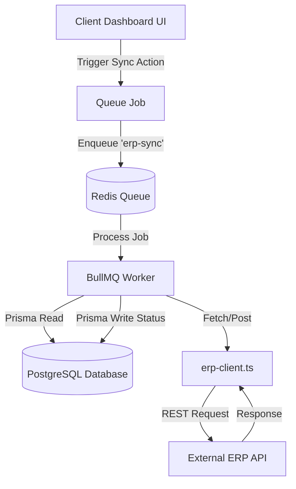

# Studio Masons ERP — Project Architecture & Developer Guide

Welcome to the **Studio Masons ERP** project codebase documentation. This document provides a point-to-point walkthrough of the project directory structure, details the purpose of each file and function, and explains how the application handles Next.js App Routing, dynamic page updates, database models, and background queue synchronization.

---

## 1. Project Directory Structure

Below is the directory structure of the `studio-masons-erp/` codebase, showing every file and directory:

```text
studio-masons-erp/
├── package.json               # Project manifest, dependencies, and script declarations
├── tsconfig.json              # TypeScript compiler configuration
├── tailwind.config.ts         # Tailwind CSS styling and theme configuration
├── postcss.config.mjs         # PostCSS configuration for styling processors
├── next.config.ts             # Next.js framework configuration options
├── components.json            # configuration file for shadcn/ui components
├── .env                       # Environment variables (DB urls, API keys)
├── .env.example               # Reference template for environment variables
├── README.md                  # Project overview documentation
├── AGENTS.md                  # Development guidelines for AI coding agents
├── CLAUDE.md                  # General project rules and CLI helper instructions
├── erp-client.ts              # API layer interacting with the external ERP endpoint
├── erp-sync.worker.ts         # BullMQ queue processor running as a background service
│
├── prisma/
│   └── schema.prisma          # Database schema models (PostgreSQL) and relations
│
├── lib/
│   ├── prisma.ts              # Singleton Prisma Client database connector
│   ├── utils.ts               # Tailwinds class-merging helper (cn)
│   └── toast.tsx              # Application-wide notification toast context and component
│
├── contexts/
│   └── ProjectContext.tsx     # Centralized global state provider for projects, vendors, and invoices
│
├── components/
│   ├── layout/
│   │   ├── Sidebar.tsx        # Vertical navigation panel fixed to the left
│   │   └── Topbar.tsx         # Header bar with search, notification dropdown, and Project Selector
│   └── ui/                    # Directory for custom/shadcn reusable UI elements (buttons, modals, etc.)
│
└── app/                       # Next.js App Router root folder
    ├── layout.tsx             # Root document layout (injects styling and fonts)
    ├── page.tsx               # Root redirect, forwards `/` requests to `/dashboard`
    ├── globals.css            # Custom CSS configurations and Tailwind styles
    ├── not-found.tsx          # Custom fallback page for 404 errors
    ├── global-error.tsx       # Root error boundary catching server/client exceptions
    │
    ├── (erp)/                 # Route Group for all dashboard-shell pages
    │   ├── layout.tsx         # Wrapper injecting Sidebar, Topbar, Toast, and Project Context
    │   ├── loading.tsx        # Fallback loader displayed during page transitions
    │   ├── error.tsx          # Error boundary capturing exceptions within the ERP routes
    │   │
    │   ├── dashboard/
    │   │   └── page.tsx       # Main dashboard: metrics, projects grid, recent activity feed
    │   ├── site-survey/
    │   │   └── page.tsx       # Site surveys logging, notes, and photos
    │   ├── design/
    │   │   └── page.tsx       # Drawing approvals, version control, and client checkoffs
    │   ├── orders/
    │   │   └── page.tsx       # procurements, vendor POs, invoices, advances, payment requests, expenses
    │   ├── quality/
    │   │   └── page.tsx       # Quality checklist (concrete, MEP, safety inspections)
    │   ├── snags/
    │   │   └── page.tsx       # On-site defect boards, task assignments, and photo proofing
    │   ├── site-progress/
    │   │   └── page.tsx       # Gantt schedules, bill of quantities (BOQ), and goods receipts (GRN)
    │   ├── audit/
    │   │   └── page.tsx       # Final civil/MEP checklists and handover certificates
    │   ├── dlp/
    │   │   └── page.tsx       # Defect Liability Period tickets and AMC maintenance due dates
    │   ├── erp-integration/
    │   │   └── page.tsx       # Integration settings panel (Tally, Zoho, webhooks, mapping, sync logs)
    │   ├── settings/
    │   │   └── page.tsx       # Profile, password, security settings
    │   └── projects/
    │       └── new/
    │           └── page.tsx   # Project onboarding wizard
    │
    └── generated/
        └── prisma/            # Output location of generated Prisma Client (types & node module)
```

---

## 2. Core Routing Architecture

This application uses the **Next.js App Router** framework.

### Route Groups
The `app/(erp)` folder uses parenthesis. In Next.js routing, directories wrapped in parentheses are **Route Groups**. This signifies that they do not add an extra segment to the URL path.
* For example, the page at `app/(erp)/dashboard/page.tsx` resolves to the URL `/dashboard`.
* The group serves to apply a shared layout shell (`app/(erp)/layout.tsx`) to all pages under it, separating them from other possible layouts (like auth pages or public pages).

### Shared Layout Shell
The layout file at [app/(erp)/layout.tsx](file:///c:/Users/sanja/Downloads/stitch_studio_masons_project_suite/studio-masons-erp/app/(erp)/layout.tsx) serves as the visual shell for the application:
1. It is a client component (`"use client";`) because it needs to feed client-side React contexts to the pages.
2. It wraps the entire dashboard subtree in the `<ToastProvider>` (notifying users of errors/successes) and the `<ProjectProvider>` (giving pages access to the selected project context).
3. Visually, it establishes a flex container. On the left, it mounts a fixed `<Sidebar />` (width `ml-64`). On the right, it displays a vertical stack containing the sticky `<Topbar />` followed by a scrollable `<main>` element rendering the page `{children}`.

### Redirects, Loading, and Errors
* **Root Redirect**: [app/page.tsx](file:///c:/Users/sanja/Downloads/stitch_studio_masons_project_suite/studio-masons-erp/app/page.tsx) uses Next.js `redirect("/dashboard")` to automatically bounce users landing on the base URL `/` straight to the dashboard.
* **Loading Boundary**: [app/(erp)/loading.tsx](file:///c:/Users/sanja/Downloads/stitch_studio_masons_project_suite/studio-masons-erp/app/(erp)/loading.tsx) mounts a beautiful spinner or skeleton structure. Next.js automatically mounts this React Suspense fallback whenever page segments are resolving server fetches or component files are loading.
* **Error Boundaries**:
  * [app/(erp)/error.tsx](file:///c:/Users/sanja/Downloads/stitch_studio_masons_project_suite/studio-masons-erp/app/(erp)/error.tsx) traps rendering failures or API crashes within the ERP route segments, allowing users to hit a "Try Again" button without crashing the entire app shell.
  * [app/global-error.tsx](file:///c:/Users/sanja/Downloads/stitch_studio_masons_project_suite/studio-masons-erp/app/global-error.tsx) serves as the ultimate fallback for errors occurring in the root layout file.

---

## 3. Dynamic State Machine & React Context

The application runs as a high-performance **Client-Side SPA** with automatic persistent synchronization. The central brain managing this dynamic behavior is located in [contexts/ProjectContext.tsx](file:///c:/Users/sanja/Downloads/stitch_studio_masons_project_suite/studio-masons-erp/contexts/ProjectContext.tsx).

### Context State & Storage
The `ProjectProvider` maintains state variables in memory and persists updates to the browser's `localStorage` so that state survives page reloads:
* **`rawProjects`**: Stores projects with their attributes (`pct`, `engineer`, `isDelayed`).
* **`selectedProjectId`**: The ID of the project selected in the Topbar dropdown.
* **`vendorPOs`**: Vendor procurement records including purchase orders, contract dates, and advance stages.
* **`invoices`**: Reconciled bills submitted by vendors.
* **`requests`**: Payment request submissions awaiting finance validation.
* **`activities`**: Event logs displaying the latest actions.

`localStorage` keys used:
* `erp-selected-project`: stores active project ID.
* `erp-vendor-pos`: stores serialized PO details.
* `erp-invoices`: stores metadata of uploaded invoices (excluding raw binary `File` objects, which cannot be serialized).
* `erp-payment-requests`: stores payment request logs.
* `erp-activity`: stores recent user operations.

### Context Operations & Functions
`ProjectProvider` exports several functions to mutate the state dynamically:

1. **`useProject()`**:
   React hook consumed by components to retrieve the current state and trigger updates. Throws an error if used outside a `<ProjectProvider>`.
2. **`getAutoStatus(pct, isDelayed)`**:
   Computes project status. Returns `"Delayed"` if `isDelayed` is flagged, `"Completed"` if `pct === 100`, `"On Track"` if `pct >= 75`, `"In Progress"` if `pct > 10`, and `"New Site"` otherwise.
3. **`updateProjectPct(projectId, percentage)`**:
   Updates a project's completion percentage (clamped between `0` and `100`). Automatically emits a new event in the activity feed.
4. **`addVendorPO(input)`**:
   Enrolls a vendor. Saves purchase order details (`poNumber`, `poValue`, `poFileName`, and optional contract constraints). If the vendor already exists, updates their details rather than creating a duplicate.
5. **`acceptVendorPO(input)`**:
   Documents vendor contract acceptance and records the advance amount requested by the site team.
6. **`approveAdvance(input)`**:
   Finance action to approve a vendor's advance request. It applies a chosen TDS % (`1%`, `2%`, or `10%`) to compute `advancePayable = advanceRequested - TDS`.
7. **`consumeAdvance(input)`**:
   Tracks the absorption of a vendor's advance payment across multiple billing cycles.
8. **`logActivity(input)`**:
   Appends a new event item to the activity timeline, maintaining a maximum capacity of 50 items.

---

## 4. Database Schema (Prisma)

The application uses a PostgreSQL database. The schema is defined in [prisma/schema.prisma](file:///c:/Users/sanja/Downloads/stitch_studio_masons_project_suite/studio-masons-erp/prisma/schema.prisma) and generates the Prisma client into a custom location inside the application: `../app/generated/prisma`.

```prisma
generator client {
  provider = "prisma-client-js"
  output   = "../app/generated/prisma"
}
```

### Database Models

| Model | Description | Relations & Key Fields |
| :--- | :--- | :--- |
| **`User`** | Represents employees, contractors, and clients. | Has `role` (`ADMIN`, `PROJECT_MANAGER`, `DESIGNER`, `SITE_ENGINEER`, `FINANCE`, `CLIENT`). Relates to `SiteSurvey`, `DesignFile`, `Snag`, `ActivityLog`. |
| **`Project`** | Core business unit for site operations. | Tracks `status` (`ACTIVE`, `ON_HOLD`, `COMPLETED`, `CANCELLED`), budget details, and coordinates all sub-entities. |
| **`SiteSurvey`** | Logs initial dimensions, site conditions, and media. | Linked to `Project` and conducted by a `User`. |
| **`DesignFile`** | Track technical drawings, plans, and 3D models. | Supports versioning and `status` (`PENDING_REVIEW`, `APPROVED_INTERNALLY`, `CLIENT_APPROVED`, `CHANGES_REQUESTED`). |
| **`Order`** | Vendor procurements and contracts. | Linked to `Project`. Tracks `status` (`DRAFT`, `SUBMITTED`, `APPROVED`, `PAID`, `REJECTED`) and relates to `VendorPayment`. |
| **`VendorPayment`**| Disbursements made against vendor purchase orders. | Linked to `Order` and tracks requested, approved, and paid timestamps. |
| **`SiteExpense`** | Out-of-pocket cash expenses logged by site engineers. | Records amount, category, incurred date, and receipt receipt URL. |
| **`Snag`** | Defect and quality issues logged on-site. | Tracks priorities, status (`OPEN`, `IN_PROGRESS`, `RESOLVED`, `CLOSED`), locations, photos, and assignees. |
| **`BOQItem`** | Bill of Quantities breakdown for estimation. | Tracks work items, units, `budgetedQty`, `installedQty`, and `unitRate`. |
| **`ProjectSchedule`**| Timeline tasks representing project schedules. | Supports hierarchical parent-child relationships (Gantt mapping). |
| **`GRNEntry`** | Goods Received Notes, tracking incoming materials. | Tracks material name, quantity received, unit, and supplier. |
| **`AuditItem`** | Quality checklists required for project handover. | Tracks checklist items, pass/fail status, sign-offs, and dates. |
| **`DLPTicket`** | Defect Liability Period issues reported post-handover. | Tracks warranty tickets and AMC due dates. |
| **`ERPSync`** | Log monitoring state transfers to external ERPs. | One-to-one mapping with `Project`, checking sync statuses. |
| **`ActivityLog`** | Admin-visible trace of project operations. | Links `User` actions to individual projects and target entity IDs. |

---

## 5. External Integration & Background Workers

To prevent network delays from blocking the user interface, the application uses an **asynchronous background queue system**.



### 1. Synchronous API Layer (`erp-client.ts`)
Located in [erp-client.ts](file:///c:/Users/sanja/Downloads/stitch_studio_masons_project_suite/studio-masons-erp/erp-client.ts), this file exports utility functions communicating with external endpoints using credentials defined in `.env`:
* **`postScopeToERP(projectId, scopeData)`**:
  POSTs project scope payloads (client metadata, location, and bill of quantities) to `${process.env.ERP_BASE_URL}/api/scope`. Authenticates via `Authorization: Bearer ${process.env.ERP_API_KEY}`.
* **`getPOFromERP(projectId)`**:
  GETs purchase orders issued by external ERPs for a specific project from `${process.env.ERP_BASE_URL}/api/purchase-orders`.

### 2. Background Queue Processor (`erp-sync.worker.ts`)
The background worker in [erp-sync.worker.ts](file:///c:/Users/sanja/Downloads/stitch_studio_masons_project_suite/studio-masons-erp/erp-sync.worker.ts) runs as an independent NodeJS process powered by **BullMQ** and connects to Redis on `localhost:6379`.

It listens on the `erp-sync` queue and handles two job types:

* **`POST_SCOPE`**:
  1. Sets the project's `ERPSync` status to `PENDING` via Prisma.
  2. Queries the database using `prisma.project.findUnique` to fetch the project details and its related `boqItems`.
  3. Maps `boqItems` to numeric quantities and rates.
  4. Triggers `postScopeToERP(...)` to transmit the scope to the external ERP.
  5. Upon success, updates `ERPSync` in the database: `status = "SYNCED"`, `scopeDataSent = true`, `lastSyncAt = new Date()`.
* **`GET_PO`**:
  1. Sets the project's `ERPSync` status to `PENDING` via Prisma.
  2. Contacts the external ERP via `getPOFromERP(...)` to query purchase order data.
  3. Upon success, updates `ERPSync` in the database: `status = "SYNCED"`, `poCreated = true`, `lastSyncAt = new Date()`.
* **Error Handling**:
  If the API call fails or the database is unreachable, the catch block updates the `ERPSync` record: `status = "FAILED"`, `errorLog = err.message`, and throws the error to mark the BullMQ job as failed.

---

## 6. Detailed File-by-File Summary

Here is what each file and function accomplishes in the project:

### App Layouts & Core
* **[app/layout.tsx](file:///c:/Users/sanja/Downloads/stitch_studio_masons_project_suite/studio-masons-erp/app/layout.tsx)**: Root layout. Imports styles (`globals.css`), Google Fonts (`DM Sans`), and Google Material Symbol Icons.
* **[app/globals.css](file:///c:/Users/sanja/Downloads/stitch_studio_masons_project_suite/studio-masons-erp/app/globals.css)**: Implements base styles, layout utilities, custom scrollbars, and color variables.
* **[app/(erp)/layout.tsx](file:///c:/Users/sanja/Downloads/stitch_studio_masons_project_suite/studio-masons-erp/app/(erp)/layout.tsx)**: Main layout wrapper for dashboard pages. Wraps content in React context providers.

### Shared Layout Components
* **[components/layout/Sidebar.tsx](file:///c:/Users/sanja/Downloads/stitch_studio_masons_project_suite/studio-masons-erp/components/layout/Sidebar.tsx)**: Navigation sidebar. Matches `usePathname()` to highlights active routes.
* **[components/layout/Topbar.tsx](file:///c:/Users/sanja/Downloads/stitch_studio_masons_project_suite/studio-masons-erp/components/layout/Topbar.tsx)**:
  * *Search bar*: Filters `projects` in real-time by name, client, or location, allowing instant navigation.
  * *Project selector dropdown*: Centralized switch. Updates the active project via `setSelectedProjectId` in `ProjectContext`.
  * *Notification dropdown*: Toggles notifications and marks them as read.

### Shared Library Utilities
* **[lib/prisma.ts](file:///c:/Users/sanja/Downloads/stitch_studio_masons_project_suite/studio-masons-erp/lib/prisma.ts)**: Exports a singleton instance of the `PrismaClient` generated inside `app/generated/prisma`. In non-production environments, attaches it to the Node global scope to prevent hot-reloads from exhausting database connection limits.
* **[lib/utils.ts](file:///c:/Users/sanja/Downloads/stitch_studio_masons_project_suite/studio-masons-erp/lib/utils.ts)**: Exports the `cn(...)` utility, combining `clsx` and `tailwind-merge` to handle dynamic CSS class merges.
* **[lib/toast.tsx](file:///c:/Users/sanja/Downloads/stitch_studio_masons_project_suite/studio-masons-erp/lib/toast.tsx)**: Exports a lightweight notification context. Provides functions like `toast.success(title, msg)`, `toast.error(...)`, `toast.warning(...)`, and `toast.info(...)` to display temporary alert messages in the top-right corner of the screen.

### Pages (under `app/(erp)/`)
* **`dashboard/page.tsx`**: Renders KPI cards (In Progress, On Hold, Delayed, Budget Utilized) and the global active projects table. Displays a scrollable feed of the last 50 activities.
* **`site-survey/page.tsx`**: Displays a log of site surveys (dimensions, photos, checklists) for the selected project. Allows logging new survey entries.
* **`design/page.tsx`**: Manages engineering blueprints. Users can upload file drawings, view file versions, and approve drawings or request changes.
* **`orders/page.tsx`**: Financial hub.
  * *Procurements tab*: Logs vendors and maps purchase orders to them.
  * *Invoices tab*: PMs review uploaded invoice parameters (tax rates, base values, advance consumption details) and approve/reject them.
  * *Payment Requests tab*: Site team requests disbursements for approved invoices.
  * *Expenses tab*: Logs miscellaneous field receipts.
* **`quality/page.tsx`**: Quality inspection checklist (grading civil structural items, plumbing pressure tests, electrical loads).
* **`snags/page.tsx`**: Defect-tracking board. Users can create snag items (with details and priorities), assign them to site engineers, upload photo proofs, and transition statuses (Open → In Progress → Resolved → Closed).
* **`site-progress/page.tsx`**: Monitors construction timelines, task progress, actual quantities installed, and Material Goods Received Notes (GRN).
* **`audit/page.tsx`**: Checklist tracking handover operations (commissioning reports, final sign-offs, structural compliance records).
* **`dlp/page.tsx`**: Manages issues reported during the Defect Liability Period and logs Annual Maintenance Contract (AMC) dates.
* **`erp-integration/page.tsx`**: Administrative panel to link third-party tools (Zoho, Tally Prime, Google Drive, Razorpay), map JSON payload fields, configure event webhook hooks, and review synchronization logs.
* **`settings/page.tsx`**: Manages personal profile details, credentials, and notification preferences.
* **`projects/new/page.tsx`**: Onboarding wizard to define a project name, choose a client, log locations, set start/end dates, allocate budgets, and input initial BOQ items.
